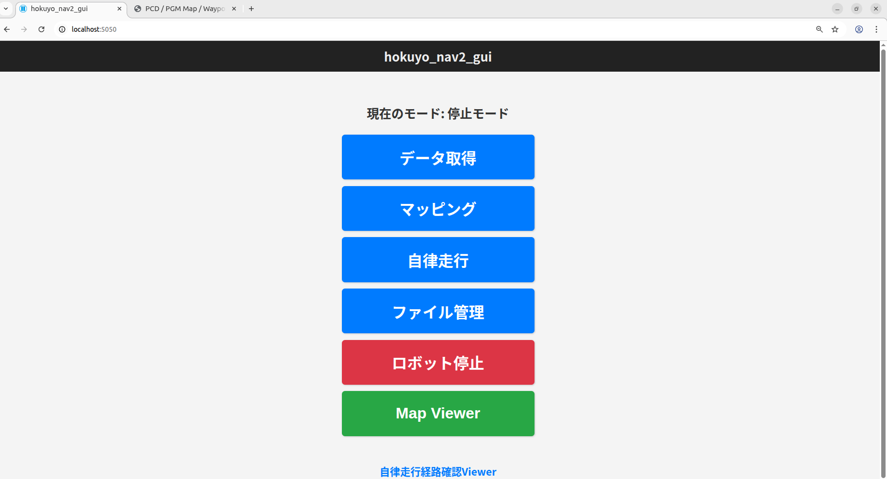
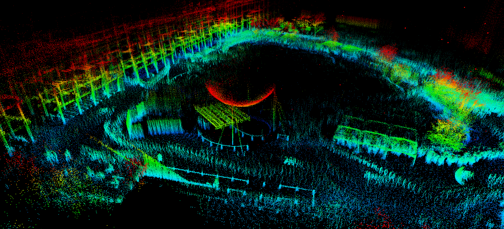
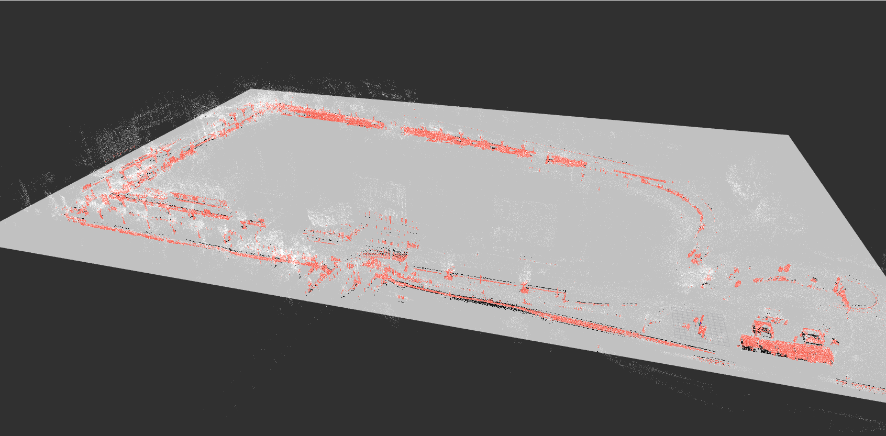
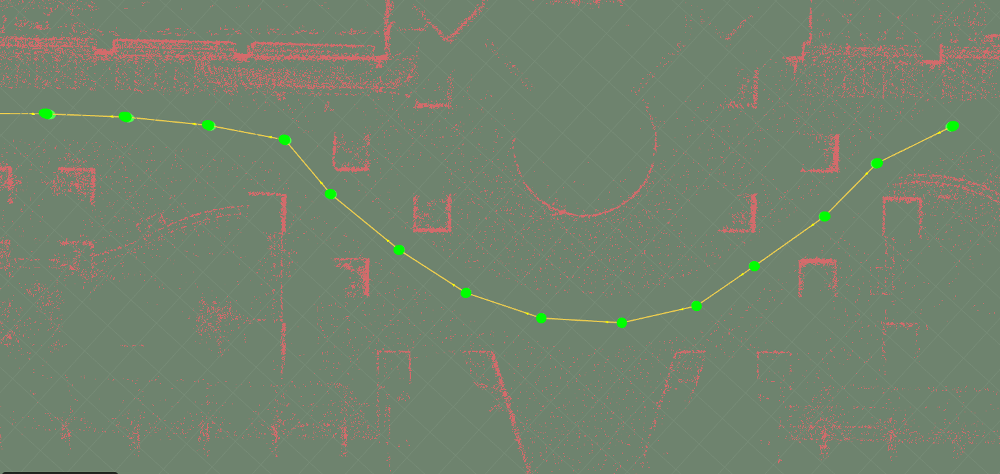
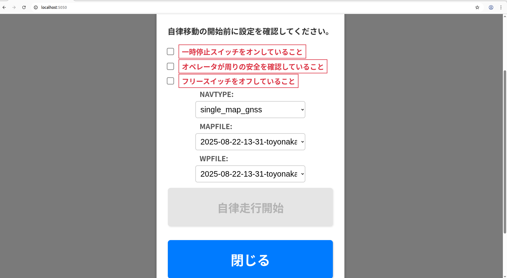
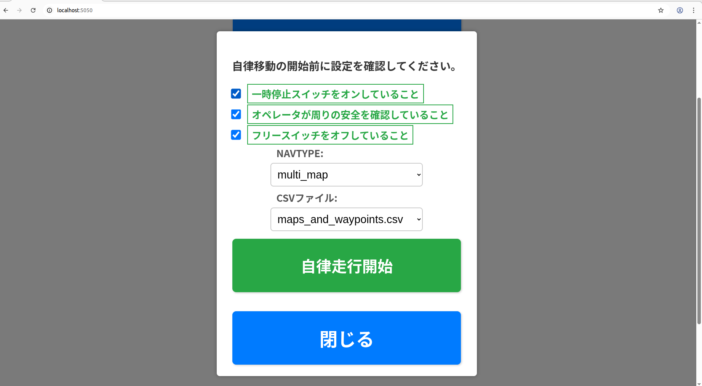
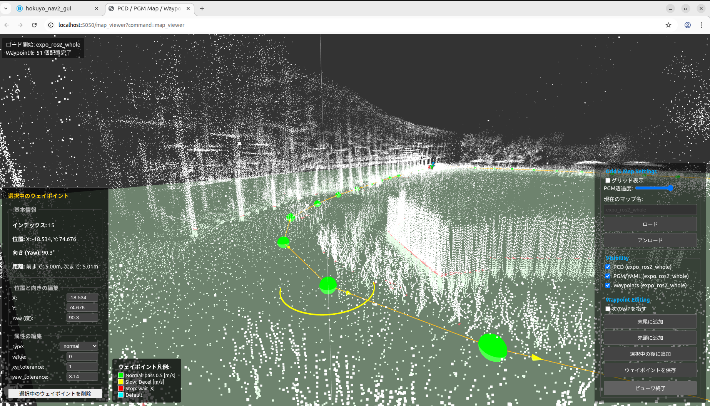
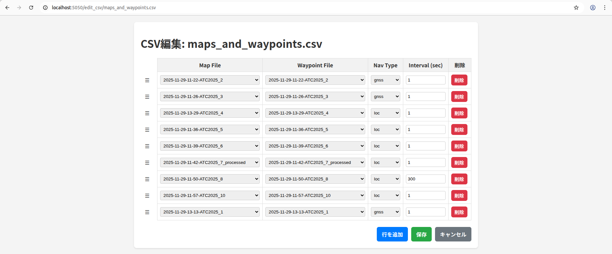
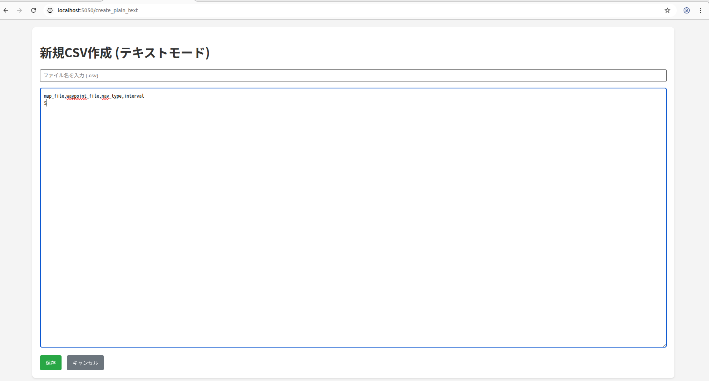

# hokuyo_navigation2_gui

`hokuyo_navigation2_gui`は、ROS 2ベースのナビゲーションおよびマッピングシステムを直感的に操作するためのWebベースのGUIです。

Flaskサーバーを介して提供され、マッピング、ナビゲーションの実行、および関連するファイル（マップ、ウェイポイントなど）の管理をブラウザから簡単に行うことができます。



---

## 目次

- [hokuyo\_navigation2\_gui](#hokuyo_navigation2_gui)
  - [目次](#目次)
  - [主な機能](#主な機能)
    - [1. データ取得](#1-データ取得)
    - [2. マッピング](#2-マッピング)
    - [3. ナビゲーション](#3-ナビゲーション)
    - [4. ファイル管理](#4-ファイル管理)
    - [5. 編集ツール](#5-編集ツール)
  - [セットアップ方法](#セットアップ方法)
    - [1. Python依存パッケージのインストール](#1-python依存パッケージのインストール)
    - [2. ファイアウォールの設定](#2-ファイアウォールの設定)
  - [実行方法](#実行方法)
    - [1. ROS 2環境のセットアップ](#1-ros-2環境のセットアップ)
    - [2. サーバーの起動](#2-サーバーの起動)
    - [3. GUIへのアクセス](#3-guiへのアクセス)
  - [各機能の使い方](#各機能の使い方)
    - [データ取得](#データ取得)
    - [マッピング](#マッピング)
    - [ナビゲーション](#ナビゲーション)
    - [ファイル管理と編集](#ファイル管理と編集)

---

## 主な機能

### 1. データ取得
- ROS Bag を取得するためにセンサやロボットのノードを起動します。

### 2. マッピング

- **3D SLAMと2Dウェイポイントファイル出力の同時実行**: ROS Bagファイルを使用して、以下のSLAMアルゴリズムを実行します。SLAM実行時にウェイポイントファイル`.json`が作成されます。
  - `p2o` ([hokuyo_slam](https://github.com/hokuyo-rd/hokuyo_slam_ros2.git)を用いた3D点群マップ)
  - `lio_raw` (LiDAR Inertial Odometry の軌跡に基づく3D点群マップ)



- **ROS Bag の内容表示**: ROS Bag を選択すると、記録されているトピックの一覧を
  ブラウザ上に表示します。トピック名・メッセージ型（日本語の説明つき）・メッセージ数・
  おおよその周波数・座標系（`frame_id`）に加えて、記録時間やファイルサイズも確認できます。
  メッセージが1件も入っていないトピックは強調表示されます。

- **設定チェック**: パラメータ設定ファイル（CSV）を選ぶと、その内容と ROS Bag の中身を
  突き合わせて、実行前に問題を知らせます。
  - コンフィグに書かれたトピックが ROS Bag に無い／中身が空／型が違う場合に、
    そのROS Bagに実際に入っている候補を提示します。
  - `orig_frame` / `target_frame` が ROS Bag のオドメトリの座標系と一致しない場合に警告します。
    （一致しないと、エラーが出ないまま中身が空の地図が作られてしまいます）
  - 設定ファイルの行の並び順が崩れている場合に警告します。
    マッピングのスクリプトは CSV を行番号で読むため、並べ替えると値がずれてしまいます。

- **設定ファイルのその場編集**: マッピングの実行画面で、パラメータ設定ファイル（CSV）を
  そのまま書き換えて保存できます。
  - トピック名の項目は、**選択中の ROS Bag に実際に記録されているトピック**が
    プルダウンの候補になります。メッセージ型が合っていてデータが入っているものには
    ★ が付き、先頭に表示されます。
  - 座標系（`orig_frame` / `target_frame`）は、ROS Bag に出てくる座標系が候補になり、
    オドメトリと一致するものに ★ が付きます。
  - 候補にない値を使いたい場合は「（直接入力）」を選ぶと文字入力に切り替わります。
  - 選択肢は色分けされます。**緑**は型が合っている／座標系が一致している候補、
    **赤**は選択中の ROS Bag に存在しない値です。
  - 別のファイル名を入力すれば、元のファイルを残したまま新しい設定として保存できます。
  - 保存すると設定チェックが自動でやり直されます。
  - 行の並び順とデフォルト値の列はそのまま保持されます（実行スクリプトが CSV を
    行番号で読むため、並べ替えると値がずれてしまいます）。

- **実行ログの表示**: マッピングや変換の実行ログをブラウザ上に表示します。
  ログの内容から失敗の原因を判別し、「点群トピック名が違う可能性がある」「ディスクの
  空き容量が足りない」といった日本語の説明と対処方法を表示します。
  処理が異常終了した場合は、完了を待たずにその場で失敗を知らせます。

- **データ処理**:
  - **PCDからPGMへの変換**: 3D点群マップ（`.pcd`）を2D占有格子マップ（`.pgm`と`.yaml`）に変換します。オプションとして、変換の際に`.json` 形式のウェイポイントファイルを指定すると、.pgm`マップ状に、指定したウェイポイントに沿って通行可能領域を生成します




### 3. ナビゲーション
- **単一マップ走行**: 指定したマップとウェイポイントファイルを使用して自律走行を開始します。自律走行は実行時に、GNSSベースか、LiDARベースの自律走行のどちらか1つを選択できます。
- **マルチマップ走行**: 複数のマップとウェイポイントを順番に走行するシナリオをCSVファイルで定義し、実行します。
- オペレータに安全意識を向けることを目的として、自律走行の開始条件としてチェック欄への入力が必須とする仕様になっています。(文言は一例なので、適宜変更してください。)






### 4. ファイル管理
- **ブラウザベースのファイル管理**:
  - マップ (`.pcd`, `.yaml`, `.pgm`)
  - ウェイポイント (`.json`)
  - 設定ファイル (`.csv`)
- **ファイル/フォルダ操作**: ディレクトリの作成、ファイルやディレクトリの削除、名前の変更が可能です。

### 5. 編集ツール


- **Map Viewer (3D)**:
  - PCDマップとPGMマップを3D空間で視覚化します。
  - **ウェイポイント編集**:
    - **追加**: マップ上をクリックして新しいウェイポイントを追加（先頭、末尾、選択中の後）。
    - **移動**: ドラッグ＆ドロップでウェイポイントの位置を直感的に調整。
    - **回転**: ギズモ(半円状のUI)を使用してウェイポイントの向き（Yaw角）を編集。
    - **属性編集**: ウェイポイントの種別（`normal`, `slow`, `stop`）や速度などの属性を編集。
    - **保存**: 編集したウェイポイントをサーバーに保存。



- **CSVエディタ**:
  - マルチマップ走行用のCSVファイルをテーブル形式で編集。
  - 利用可能なマップファイルとウェイポイントファイルをドロップダウンから選択可能。
  - ドラッグ＆ドロップで行の順序を簡単に入れ替え可能。



- **テキストエディタ**:
  - すべての管理対象ファイルをプレーンテキストとして直接編集可能。



---

## セットアップ方法

### 1. Python依存パッケージのインストール
必要なPythonパッケージをインストールします。

```bash
pip3 install flask flask-sockets gevent gevent-websocket websockets pyyaml
```

### 2. ファイアウォールの設定

GUIはデフォルトでポート`5050`を使用します。ファイアウォールが有効な場合は、このポートへのアクセスを許可してください。rosbag の取得に vizanti を用いる場合は以下を参考にポートへのアクセスを許可してください

```bash
sudo ufw allow 5050/tcp
sudo ufw allow 5050
sudo ufw allow 5050/tcp
sudo ufw allow 5000
sudo ufw allow 5000/tcp
sudo ufw allow 5001
sudo ufw allow 5001/tcp
sudo ufw allow 8000
sudo ufw allow 8000/tcp
sudo ufw allow 9000
sudo ufw allow 9000/tcp
sudo ufw allow 9090
sudo ufw allow 9090/tcp
sudo ufw enable
```

---

## 実行方法

### 1. ROS 2環境のセットアップ

[hokuyo_navigation2](https://github.com/hokuyo-rd/hokuyo_navigation2.git) ワークスペースをROS 2環境にセットアップします。

### 2. サーバーの起動

`hokuyo_navigation2_gui`ディレクトリ内で、Flaskサーバーを起動します。

```bash
# サーバーを起動
python3 server.py
```

サーバーが起動すると、コンソールに以下のようなメッセージが表示されます。

```
Flask Server starting at http://0.0.0.0:5050
WebSocket Proxy server started at ws://0.0.0.0:5050/ws
```

### 3. GUIへのアクセス

Webブラウザを開き、サーバーを実行しているマシンのIPアドレスとポート`5050`を指定してアクセスします。

**URL**: `http://<サーバーのIPアドレス>:5050`

---

## 各機能の使い方

### データ取得
1. メイン画面で「データ取得」ボタンをクリックします。
2. センサやモータドライバの起動スクリプトが実行され、起動画面が表示されます。 
- 起動したいセンサやモータドライバの実行スクリプトは、`hokuyo_navigation2/script/start_getting_rosbag.sh` 内に記述してください。
- このモードのときに、ROS Bag を取得してください。
- 一例として ROS Bag の取得には、[vizanti](https://github.com/hokuyo-rd/vizanti.git) を用いています。

### マッピング
1. メイン画面で「マッピング」ボタンをクリックします。
2. ポップアップから実行したいマッピングの種類（`p2o`, `lio_raw`, `pcd2pgm`）を選択します。
3. ファイルブラウザが表示されるので、処理対象のROS BagまたはPCDファイルを選択します。
4. 「ROS Bag の内容」で、必要なトピックが記録されているかを確認します。
5. 出力ファイル名とパラメータ設定ファイルを選びます。設定ファイルを選ぶと「設定チェック」が
   実行され、コンフィグと ROS Bag の食い違いがあれば、その場で対処方法とともに表示されます。
   問題があるまま実行しようとすると確認ダイアログが表示されます。
6. 食い違いがあれば「パラメータ設定ファイルを編集する」を開き、プルダウンから
   ROS Bag に記録されているトピック名・座標系を選び直して保存します。
   元のファイルを残したい場合は、保存するファイル名を変えてください。
7. 処理を開始すると、進捗と「実行ログ」が表示されます。失敗した場合は、原因の説明が
   実行ログの上に表示されます。うまくいかないときは「ログをコピー」で実行ログを控えて
   担当者に連絡してください。

> 実行ログは `hokuyo_navigation2/log/gui/` に保存されます（最新50件のみ保持）。

### ナビゲーション
1. メイン画面で「自律走行」ボタンをクリックします。
2. **単一マップ**: 「Map File」と「Waypoint File」をドロップダウンから選択し、「実行」ボタンを押します。
3. **マルチマップ**: 「CSV File」からシナリオファイルを選択し、「実行」ボタンを押します。

### ファイル管理と編集
1. メイン画面で「File Management」ボタンをクリックします。
2. 管理したいファイルの種類（Map, Waypoint, Config）を選択します。
3. ファイルブラウザが表示されます。
   - **新規CSVファイル作成**: 「作成する形式」で、マッピング用パラメータ設定と
     マルチマップ走行シナリオのどちらを作るか選べます。マッピング用を選ぶと
     「参考にするROS Bag」も選べるようになり、そのROS Bagに記録されている
     トピック名と座標系をあらかじめ埋めた状態でファイルが作られます。
     作成後はそのままプルダウン編集画面が開き、参考にしたROS Bagも引き継がれます。
   - **マッピング設定を編集**: マッピング用のパラメータ設定CSVには「マッピング設定を編集」
     ボタンが出ます。項目ごとのプルダウンで編集でき、「トピック名・座標系の候補にする
     ROS Bag」を選ぶと、そのROS Bagに記録されているトピック名・座標系が候補になります
     （緑=型や座標系が一致、赤=そのROS Bagに存在しない値）。
   - **テキスト編集**: 各ファイルの横にある「テキスト編集」ボタンで、プレーンテキストとして編集できます。
   - **CSV編集**: `.csv`ファイルの横にある「編集」ボタンで、専用のテーブルエディタが開きます。
   - **Map Viewer**: メイン画面の「Map Viewer」ボタンから、マップとウェイポイントを3Dで表示・編集できます。
   - **削除**: 各ファイル/フォルダの横にある「削除」ボタン、またはチェックボックスで複数選択して一括削除が可能です。
   - **名前変更**: ファイル名をダブルクリックすると、名前を変更できます。